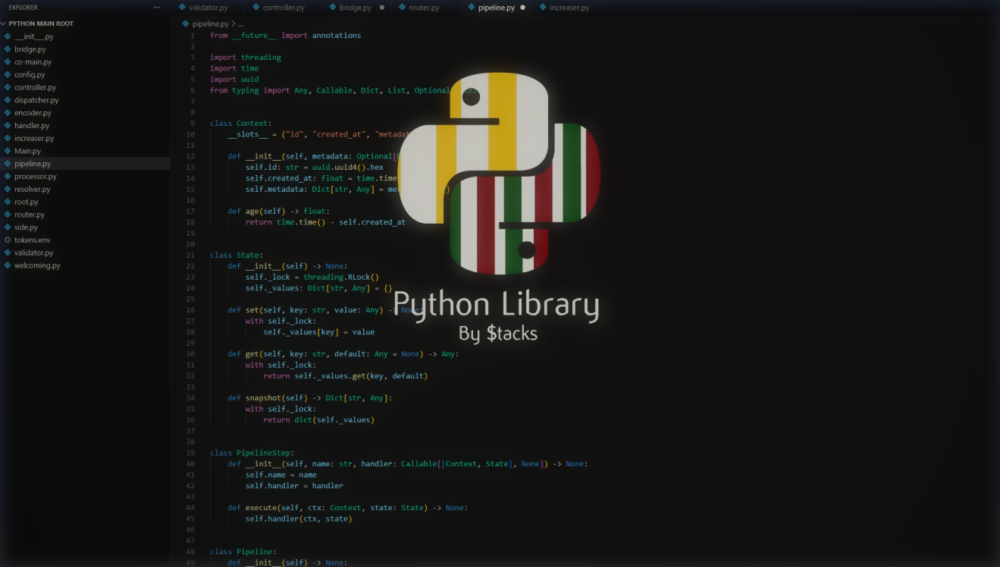

# Pylib 
- A Python Tool Library I Made.

# Tool Folders
> Heads up!, Every Tool Folder Has It's Own Instructions File Or .txt
> I Don't Test Them Cuz i'm too confident i made them right..
<h3>Autorun Using Python</h3>
- Contains Instructions.txt , Discord.py , Autorun.inf , Example.html.
